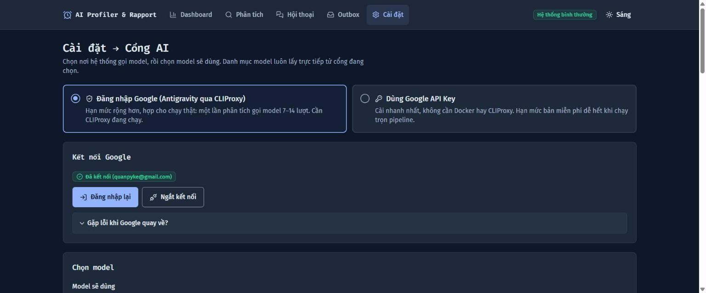
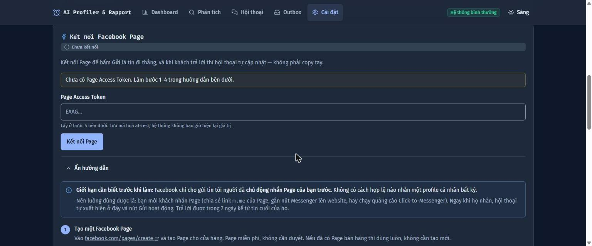
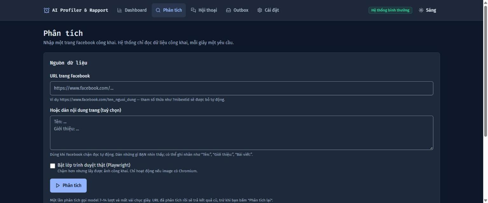
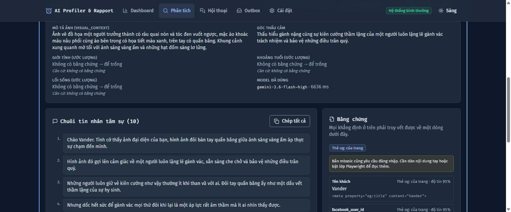
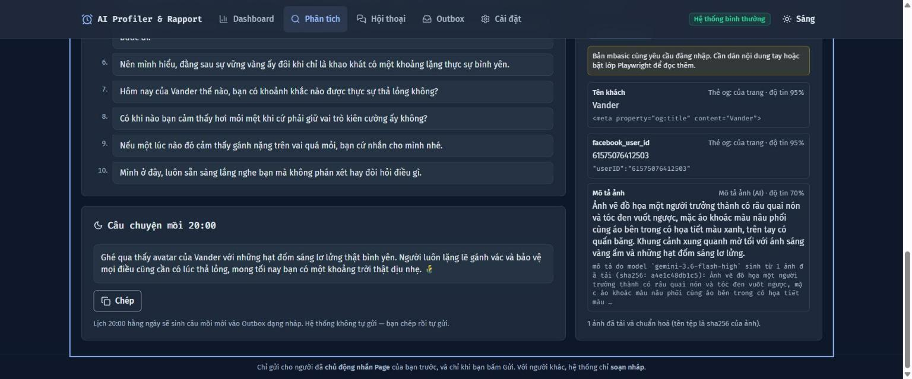
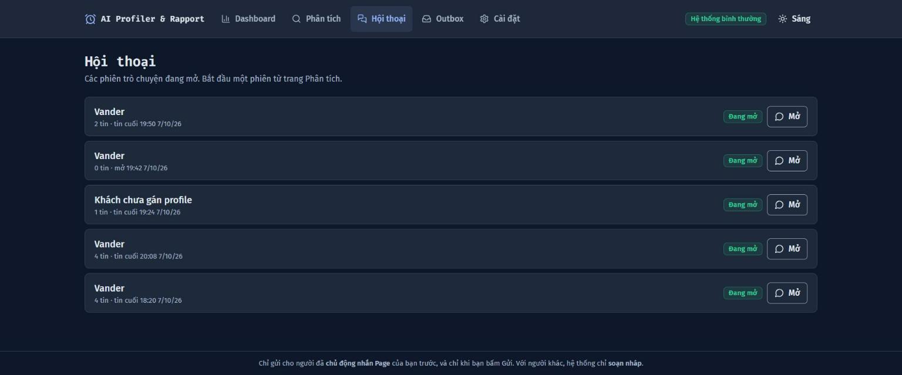
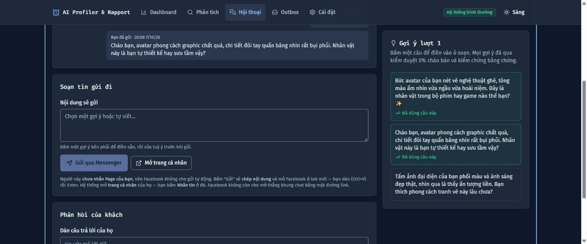
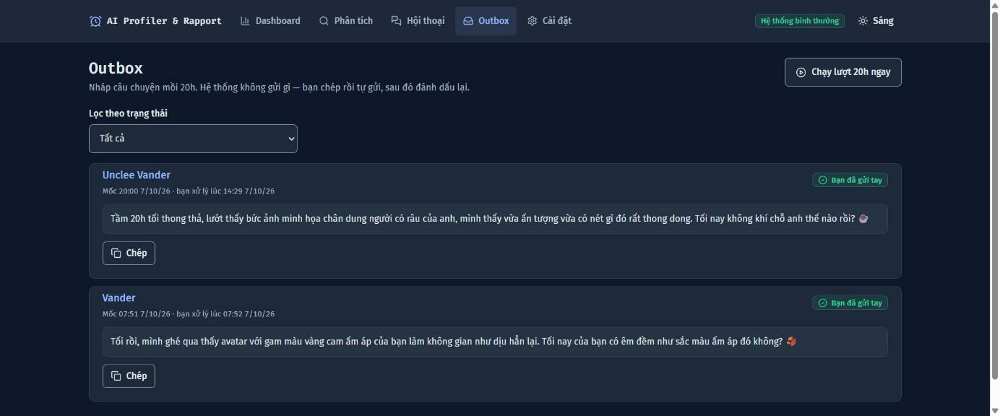

# Hướng dẫn sử dụng

Tài liệu này viết cho **người dùng bình thường** — không cần biết lập trình. Chỗ
nào buộc phải dùng từ kỹ thuật, nó được giải thích ngay tại chỗ.

> **Chưa cài đặt?** Nhờ người phụ trách kỹ thuật làm theo [README.md](README.md)
> trước. Tài liệu này bắt đầu từ lúc bạn mở được trang web ở địa chỉ
> `http://localhost:5173`.

---

## Mục lục

| | |
|---|---|
| **Hiểu công cụ** | [1. Công cụ này làm gì](#1-công-cụ-này-làm-gì) · [2. Ba điều nó sẽ không làm](#2-ba-điều-nó-sẽ-không-làm) |
| **Cài đặt ban đầu** | [3. Bật "bộ não" AI (bắt buộc)](#3-bật-bộ-não-ai-bắt-buộc) · [4. Cho phép đọc bài đăng (nên làm)](#4-cho-phép-đọc-bài-đăng-nên-làm) · [5. Bật gửi tự động (tuỳ chọn)](#5-bật-gửi-tự-động-tuỳ-chọn) |
| **Dùng hằng ngày** | [6. Tìm hiểu một khách hàng](#6-tìm-hiểu-một-khách-hàng) · [7. Trò chuyện qua lại](#7-trò-chuyện-qua-lại) · [8. Câu mồi mỗi tối 20h](#8-câu-mồi-mỗi-tối-20h) |
| **Khi có vấn đề** | [9. Hiểu các nhãn trạng thái](#9-hiểu-các-nhãn-trạng-thái) · [10. Gặp lỗi thì làm gì](#10-gặp-lỗi-thì-làm-gì) |

---

## 1. Công cụ này làm gì

Bạn đưa vào **một đường link Facebook** của khách hàng. Công cụ sẽ:

1. Đọc những gì trang đó để **công khai** — tên, ảnh đại diện, bài đăng.
2. Nhờ AI **mô tả ảnh** và tìm một điểm chung để bắt chuyện.
3. Soạn sẵn **10 tin nhắn làm quen**, không hề chào bán gì.

Màn hình chính trông như thế này:


Bốn ô trên cùng là số liệu đếm thật từ dữ liệu, không phải ước lượng. Bảng bên
dưới là những khách gần đây — bấm vào tên để xem chi tiết.

---

## 2. Ba điều nó sẽ không làm

Biết trước ba điều này sẽ tránh được hầu hết hiểu nhầm.

### Nó không bịa

Mọi câu nó viết đều phải dựa trên thứ **đọc được thật**. Nếu trang Facebook của
khách bị khoá, nó sẽ nói thẳng *"không đọc được"* thay vì đoán bừa. Một kết quả
trống **không phải lỗi** — đó là sự thật về trang đó.

### Nó không chào bán

Mọi tin nhắn đều đi qua một bước kiểm tra tự động. Câu nào nhắc tới giá, khuyến
mãi, hay sản phẩm đều bị loại và viết lại. Đây là tin **làm quen**, để mở đầu
một mối quan hệ — không phải tin bán hàng.

### Nó chỉ gửi cho người đã nhắn bạn trước

Đây là **luật của Facebook**, không phải lựa chọn của công cụ. Facebook không
cho phép bất kỳ phần mềm nào nhắn tin cho một người lạ chưa từng liên hệ với
bạn — đó là cách họ chặn tin rác.

Với những người chưa nhắn bạn, công cụ vẫn soạn sẵn tin; bạn chỉ cần bấm một
nút để nó **chép sẵn và mở Facebook**, rồi bạn dán và gửi. Xem [mục 7](#7-trò-chuyện-qua-lại).

---

## 3. Bật "bộ não" AI (bắt buộc)

> ⚠️ **Chưa làm bước này thì không chạy được gì cả.** Công cụ không đi kèm sẵn
> tài khoản AI nào, và nó cố ý không tự chọn thay bạn.

Bấm **Cài đặt** trên thanh menu trên cùng.



Bạn có **hai lựa chọn**, chỉ cần một:

| | Đăng nhập Google | Dùng Google API Key |
|---|---|---|
| **Cách làm** | Bấm nút, đăng nhập như vào Gmail | Dán một dòng mã |
| **Dùng được nhiều không** | Thoải mái, hợp chạy thật | Bản miễn phí nhanh hết |
| **Chọn khi** | Bạn dùng thường xuyên | Chỉ muốn thử nhanh |

**Mỗi lần phân tích một khách tốn 7–14 lượt hỏi AI.** Nếu định dùng nhiều, hãy
chọn đường Đăng nhập Google.

### Cách 1 — Đăng nhập Google

1. Bấm **Đăng nhập Google**.
2. Cửa sổ Google hiện ra → đăng nhập → bấm đồng ý.
3. Xong, bạn sẽ thấy nhãn xanh **"Đã kết nối"** kèm địa chỉ email.

*Nếu Google báo lỗi không quay về được:* hãy **sao chép toàn bộ đường link** trên
thanh địa chỉ lúc đó, rồi dán vào ô **"Gặp lỗi khi Google quay về?"** ngay trên
trang Cài đặt.

### Cách 2 — Dùng Google API Key

**"API key" là gì?** Hãy hiểu nó như một chiếc chìa khoá dạng chữ — bạn đưa chìa
cho công cụ để nó thay bạn hỏi AI.

1. Vào [aistudio.google.com/apikey](https://aistudio.google.com/apikey) và tạo một chìa khoá.
2. Sao chép, dán vào ô **API key** → bấm **Lưu**.

Chìa khoá được **mã hoá** trước khi lưu, và không bao giờ hiện lại trên màn hình.

### Rồi chọn "model"

**"Model" là gì?** Là phiên bản AI cụ thể sẽ làm việc. Giống như chọn loại xe —
cùng để đi, nhưng khác nhau về tốc độ và khả năng.

Kéo xuống mục **Chọn model**, chọn một cái trong danh sách, rồi bấm
**Kiểm tra kết nối**.

Mỗi model ghi rõ có **"đọc được ảnh"** hay không. **Hãy chọn loại đọc được ảnh** —
ảnh đại diện thường là nguồn thông tin giàu nhất của một trang Facebook, chọn sai
thì chất lượng tin nhắn giảm rõ rệt.

> 💡 **Luôn bấm "Kiểm tra kết nối" trước khi dùng thật.** Có model nằm trong danh
> sách nhưng nhà cung cấp đã ngừng phục vụ — không kiểm trước thì bạn chờ hơn một
> phút rồi mới nhận báo lỗi.

---

## 4. Cho phép đọc bài đăng (nên làm)

Facebook **che nội dung bài viết** với người chưa đăng nhập — kể cả bài để chế độ
Công khai. Không có bước này, công cụ chỉ đọc được tên và ảnh đại diện.

Có bước này thì tin nhắn bám được vào **nội dung bài đăng thật**. Khác biệt rất
lớn về chất lượng.

> ⚠️ **Đọc kỹ trước khi làm.** Bước này cho công cụ đọc Facebook **dưới danh
> nghĩa tài khoản của bạn**. Facebook có thể gắn cờ hoặc khoá tài khoản bị dùng
> để truy cập tự động.
>
> **Khuyên dùng một tài khoản phụ của chính bạn.** Và chỉ dùng tài khoản của
> mình — dùng tài khoản người khác là sai cả về pháp lý lẫn điều khoản Facebook.

**Các bước lấy "cookie"** (cookie là một đoạn chữ chứng minh bạn đang đăng nhập):

1. Mở `facebook.com` trên trình duyệt, đảm bảo đã đăng nhập.
2. Nhấn phím **F12** — một bảng công cụ hiện ra bên cạnh.
3. Chọn thẻ **Network**, rồi **tải lại trang** (F5).
4. Bấm vào dòng đầu tiên trong danh sách hiện ra.
5. Tìm mục **Request Headers** → tìm dòng bắt đầu bằng `Cookie:`.
6. **Sao chép toàn bộ** đoạn chữ dài phía sau chữ `Cookie:`.
7. Quay lại Cài đặt → dán vào ô **Cookie Facebook** → bấm **Kiểm tra & lưu**.

Công cụ sẽ **thử kết nối Facebook ngay** để báo cho bạn biết cookie còn dùng được
hay đã hết hạn — thay vì để bạn phát hiện lúc đang cần.

---

## 5. Bật gửi tự động (tuỳ chọn)

Bước này cho phép bấm **Gửi** là tin đi thẳng, và khi khách trả lời thì cuộc trò
chuyện **tự cập nhật**. Không làm thì công cụ vẫn chạy đầy đủ, chỉ là bạn gửi tin
bằng tay.



### Đọc phần này trước khi bắt tay làm

Facebook chỉ cho gửi tin tới người **đã chủ động nhắn Trang (Page) của bạn
trước**. Không có ngoại lệ.

Nên cách dùng đúng **không phải** đi tìm người để nhắn, mà là **làm cho khách
nhắn bạn trước**, rồi AI lo toàn bộ phần sau:

- Chạy **quảng cáo Click-to-Messenger** (cách tiếp cận nhiều người nhất)
- Gắn **nút Messenger** lên website
- Đặt link `m.me/<tên-page>` ở phần giới thiệu, bài đăng, chữ ký email
- In **mã QR** của Page lên bao bì, đặt tại quầy

Mỗi người bấm vào là một khách mà công cụ gửi tự động được ngay.

### Bảy bước

Hướng dẫn đầy đủ nằm sẵn trong **Cài đặt → Kết nối Facebook Page → "Chưa có
Page? Xem hướng dẫn từng bước"**, kèm ô bấm-để-copy. Tóm tắt:

| Bước | Việc làm |
|---|---|
| 1 | Tạo một **Facebook Page** (miễn phí, không cần duyệt) |
| 2 | Tạo **ứng dụng Meta** tại `developers.facebook.com`, chọn loại **Business** |
| 3 | Trong ứng dụng: **Add Product → Messenger → Set Up** |
| 4 | **Settings → Access Tokens** → chọn Page → **Generate Token** → dán vào Cài đặt |
| 5 | Nhờ người kỹ thuật điền 2 dòng vào file cấu hình rồi khởi động lại |
| 6 | Nhờ người kỹ thuật mở một đường kết nối công khai |
| 7 | Quay lại Meta → **Webhooks → Add Callback URL** → dán đường vừa có |

Bước 5–6 cần người quen dòng lệnh. Bước 1–4 và 7 bạn tự làm được.

### Hai chỗ sai phổ biến nhất

❌ **Dán nhầm loại mã.** Phải là **Page** Access Token, không phải User Access
Token. Công cụ từ chối ngay lúc lưu — chứ không để bạn phát hiện lúc đang nói
chuyện với khách.

❌ **Chọn nhầm Page.** Nếu bạn quản lý nhiều Page, mã phải thuộc đúng Page mà
khách đã nhắn.

### Lưu ý về giai đoạn thử nghiệm

Ứng dụng Meta mới tạo ở chế độ **thử nghiệm** (Development). Ở chế độ này nó chỉ
nhắn được cho người **có vai trò** trong ứng dụng. Để thử, thêm tài khoản test
vào **App Roles → Testers** rồi chấp nhận lời mời từ tài khoản đó.

Muốn nhắn **mọi khách thật**, ứng dụng phải qua **xét duyệt của Meta** — cần
trang chính sách riêng tư, biểu tượng ứng dụng, xác minh doanh nghiệp và video
minh hoạ. Lưu ý: **tên ứng dụng không được chứa** chữ "Messenger", "Facebook",
"Instagram" hay "Meta" — đó là tên thương hiệu của họ.

---

## 6. Tìm hiểu một khách hàng

Bấm **Phân tích** trên menu.



Dán link Facebook của khách vào ô trên cùng → bấm **Phân tích**. Chờ vài chục
giây, bạn sẽ thấy từng bước chạy: đọc trang → xem ảnh → dựng hồ sơ → viết tin →
kiểm duyệt.

### Kết quả gồm những gì



| Phần | Ý nghĩa |
|---|---|
| **Mô tả ảnh** | AI nhìn ảnh đại diện và kể lại nó thấy gì |
| **Góc thấu cảm** | Điểm chung để bắt chuyện tự nhiên |
| **Giới tính / tuổi / lối sống** | Ghi *"Không có bằng chứng → để trống"* nếu không chắc — **đây là điều tốt** |
| **Bằng chứng** (cột phải) | Trích nguyên văn nguồn của từng thông tin |

Cột **Bằng chứng** là thứ đáng tin nhất trên màn hình: mọi khẳng định ở bên trái
đều phải truy ngược được về một dòng ở đây.

Kéo xuống là **10 tin nhắn** và **câu mồi 20h**:



Bấm **Chép tất cả** để lấy cả 10 tin, hoặc **Tải output.json** nếu cần file dữ liệu.

### Nếu trang bị khoá

Bạn sẽ thấy nhãn **"Một phần / Riêng tư"** kèm câu giải thích đọc được tới đâu.
**Đây là kết quả hợp lệ, không phải lỗi.**

Khi đó dùng cách thủ công: tự mở trang Facebook đó, bôi đen phần nội dung bạn
nhìn thấy, chép lại, rồi dán vào ô **"Hoặc dán nội dung trang"** ở trang Phân
tích. Công cụ xử lý y hệt.

### Phân tích lại

Dán lại cùng một link sẽ **trả kết quả cũ**, không chạy lại — để khỏi tốn lượt
hỏi AI. Muốn chạy lại thật thì bấm nút **Phân tích lại**.

---

## 7. Trò chuyện qua lại

Khác với 10 tin ở trên (viết sẵn một lần rồi thôi), đây là **cuộc trò chuyện đang
diễn ra** — gợi ý tiếp theo đọc được câu khách vừa trả lời.

```
Bắt đầu phiên  →  AI đọc bài đăng + ảnh  →  gợi ý lượt 1
      ↓
bạn chọn một câu  →  bấm Gửi
      ↓
khách trả lời  →  gợi ý lượt 2, bám vào câu họ vừa nói
      ↓
              … lặp lại …
```

### Bắt đầu

Ở trang kết quả phân tích, bấm **Bắt đầu phiên làm việc**. Các cuộc đang mở nằm ở
menu **Hội thoại**:



### Màn hình trò chuyện



Bên phải là **gợi ý của AI** — bấm một câu để điền sẵn vào ô soạn bên trái, sửa
tuỳ ý, rồi gửi.

### Hai kiểu gửi — công cụ tự chọn giúp bạn

**Kiểu tự động** — khi người này đã nhắn Page của bạn và bạn đã kết nối Page. Nút
ghi **"Gửi"**. Bấm là tin đi thẳng. Khách trả lời thì màn hình **tự cập nhật** kèm
gợi ý mới, bạn không phải làm gì thêm.

**Kiểu thủ công** — mọi trường hợp còn lại. Nút ghi **"Gửi qua Messenger"**. Bấm
thì công cụ:

1. **Chép sẵn** nội dung vào bộ nhớ tạm
2. **Mở trang Facebook** của khách ở tab mới

Việc của bạn: bấm **Nhắn tin** trên trang đó → dán (`Ctrl+V`) → Enter.

> 💡 **Vì sao phải mở trang cá nhân chứ không vào thẳng khung chat?** Facebook
> không còn đường link nào mở thẳng cuộc trò chuyện cá nhân — chúng tôi đã thử cả
> ba cách và đều hỏng. Bấm "Nhắn tin" mở khung chat ngay trong trang. Thêm một cú
> bấm, nhưng luôn chạy đúng.

Sau khi gửi, dán câu trả lời của khách vào ô **"Phản hồi của khách"** rồi bấm
**Ghi phản hồi & gợi ý tiếp**.

### Khi khách nhắn bạn trước

Nếu đã bật gửi tự động, một người nhắn Page sẽ **tự tạo cuộc trò chuyện mới**
trong mục Hội thoại, kèm sẵn gợi ý trả lời — không ai phải bấm gì. Cuộc đó hiện
tên là *"Khách từ Messenger (chưa gán profile)"*.

### Nếu không có gợi ý nào

Công cụ sẽ **nói rõ lý do** thay vì để bạn nhìn một danh sách trống. Thường là cả
lô bị bước kiểm duyệt loại. Bạn tự viết ở ô soạn là được.

---

## 8. Câu mồi mỗi tối 20h

Mỗi ngày lúc **20:00**, công cụ tự viết một câu mở chuyện mới cho từng khách đã
phân tích, rồi để vào mục **Outbox**.



Với mỗi câu bạn có thể: **Chép** → tự gửi → bấm **Tôi đã gửi tay**, hoặc **Bỏ nháp**.

> ⚠️ **Outbox không bao giờ tự gửi.** Đây là nội dung viết cho người **chưa hề
> liên hệ** bạn; gửi tự động chỗ này đúng là tin nhắn rác. Công cụ không có chức
> năng đó, và có bước kiểm tra tự động để nó không bao giờ xuất hiện.

Muốn xem thử ngay mà không chờ tới 20h thì bấm **Chạy lượt 20h ngay**.

---

## 9. Hiểu các nhãn trạng thái

| Nhãn | Nghĩa | Bạn nên làm gì |
|---|---|---|
| 🟢 **Thành công** | Đọc đủ dữ liệu, tin nhắn đã sẵn sàng | Dùng bình thường |
| 🟡 **Một phần / Riêng tư** | Trang bị khoá hoặc đọc được quá ít | Dùng cách dán tay ([mục 6](#nếu-trang-bị-khoá)) |
| 🔴 **Không qua kiểm duyệt** | Viết lại 2 lần vẫn chưa đạt chuẩn | Thử phân tích lại, hoặc tự viết |
| 🔴 **Lỗi** | Trục trặc hệ thống hoặc kết nối AI | Xem [mục 10](#10-gặp-lỗi-thì-làm-gì) |

**Nhãn "0% chào bán"** chỉ hiện khi thật sự có nội dung **và** nội dung đó đã qua
kiểm duyệt. Nếu chuỗi tin trống thì nhãn này **không** hiện — xác nhận "đã duyệt"
cho một chuỗi rỗng vừa vô nghĩa vừa gây hiểu nhầm.

---

## 10. Gặp lỗi thì làm gì

### Lỗi thường gặp

| Bạn thấy | Nguyên nhân | Cách xử lý |
|---|---|---|
| Danh sách model trống rỗng | Chưa kết nối AI | Làm lại [mục 3](#3-bật-bộ-não-ai-bắt-buộc) |
| Chạy rất lâu rồi báo lỗi | Model đã ngừng phục vụ | Bấm **Kiểm tra kết nối**, đổi model khác |
| Lúc nào cũng "Một phần / Riêng tư" | Facebook che nội dung | Thêm cookie ([mục 4](#4-cho-phép-đọc-bài-đăng-nên-làm)) hoặc dán tay |
| Mục "Mô tả ảnh" luôn trống | Model không đọc được ảnh | Chọn model có nhãn *đọc được ảnh* |
| Dán lại link mà không chạy lại | Cố ý, để khỏi tốn lượt hỏi AI | Bấm **Phân tích lại** |
| Bấm Gửi báo "chưa liên kết" | Người này chưa nhắn Page của bạn | Dùng kiểu thủ công, hoặc mời họ nhắn trước |

### Các thông báo lỗi có mã

| Mã | Nghĩa | Cách xử lý |
|---|---|---|
| `E-LLM-409-NOCONF` | Chưa chọn nơi gọi AI | Vào Cài đặt chọn |
| `E-LLM-409-AUTH` | Hết phiên hoặc sai chìa khoá | Kết nối lại. **Đừng thử lại liên tục** — sai 5 lần có thể bị chặn 30 phút |
| `E-MSG-409-OFF` | Chưa kết nối Page | Làm [mục 5](#5-bật-gửi-tự-động-tuỳ-chọn) |
| `E-MSG-409-NOLINK` | Người này chưa nhắn Page | Mời họ nhắn trước, hoặc gửi thủ công |
| `E-MSG-409-WINDOW` | Quá 7 ngày kể từ tin cuối của họ | Chờ họ nhắn lại |

### Khi cần nhờ người kỹ thuật

Nếu không tự xử lý được, hãy nhờ họ chạy lệnh này để xem nhật ký hệ thống:

```bash
docker compose logs -f api
```

Nhật ký **không bao giờ chứa** mật khẩu hay chìa khoá của bạn. Nếu bạn thấy một
giá trị trông giống chìa khoá trong đó, đó là lỗi cần báo lại.
